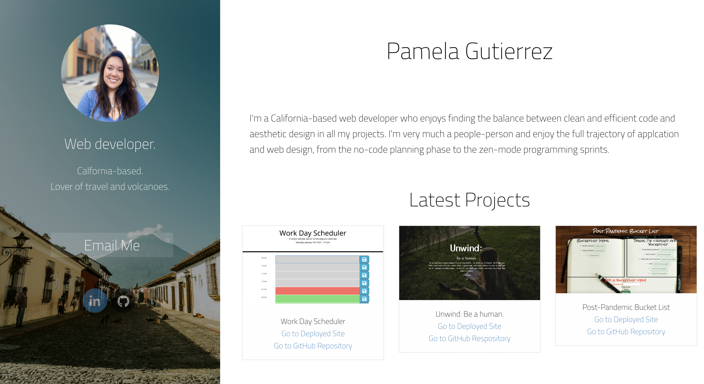

# Pamela Gutierrez Portfolio

This portfolio showcases some of my recent work and also provides contact information for potential employeers and connections. 



## **Built With**
* [HTML](https://developer.mozilla.org/en-US/docs/Web/HTML)
* [CSS](https://developer.mozilla.org/en-US/docs/Web/CSS)
* [GitHub](https://github.com/)
* [Foundation](https://get.foundation/index.html)
*  Git - used to track changes to code
______________________________________________________________________________
  
### **Summary**

The portfolio was built using Foundation CSS Framework combined with custom CSS and HTML.
______________________________________________________________________________

#### **Code Snippet**

One of the features I discovered was while building this portfolio was how to use social media buttons with Foundation CSS. Among the many available features, css properties can be used to arimate and transform simple elements. 

Using -webkit transform to animate social media buttons:
```
       .rounded-social-buttons .social-button:hover, .rounded-social-buttons .social-button:focus {
  -webkit-transform: rotate(360deg);
      -ms-transform: rotate(360deg);
          transform: rotate(360deg);
}

```
______________________________________________________________________________

### **Author Links**

* **PAMELA GUTIERREZ**
- [Link to Portfolio Site](https://pamela-gutierrez.github.io/pamela_portfolio/)
- [Link to Github](https://github.com/pamela-gutierrez) 
- [Link to LinkedIn](www.linkedin.com/in/pamela-gutierrez)

* **UC Berkeley Coding Bootcamp**
  
______________________________________________________________________________

#### **License**

This project is licensed under the MIT License